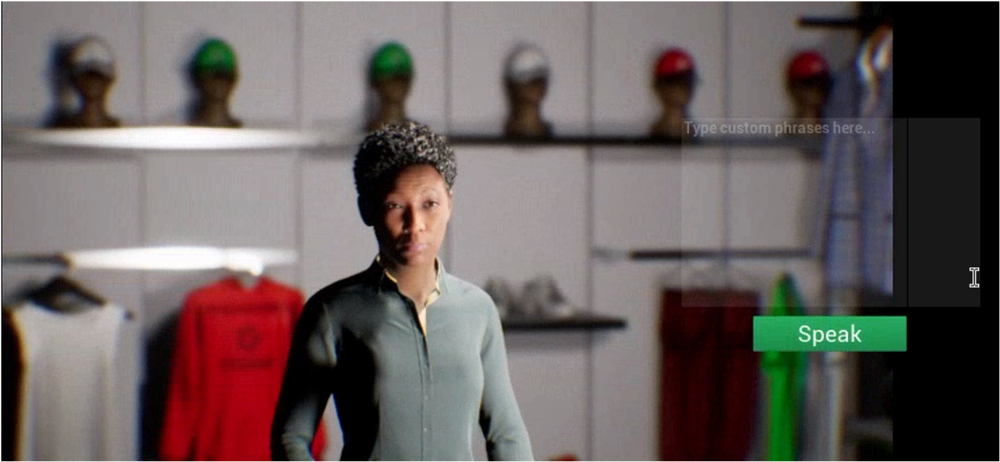

# AWS Virtual Customer Assistant

This Unreal Engine sample project demonstrates how to bring Epic Games' [MetaHuman digital characters](https://www.unrealengine.com/en-US/digital-humans) to life using the Amazon Polly text-to-speech and Amazon Lex NLP services from AWS. Use this project as a starting point for creating your own Unreal Engine applications that leverage Amazon Polly to give voice to your MetaHumans using one of 16 different English language voices spanning 5 dialects. Or extend this project to use any of Polly's 60+ voices covering 20+ languages and 13+ dialects.

**Contents**

- [Quick Start](#quick-start)
- [Developer Guide](#developer-guide)
- [Getting Help](#getting-help)
- [Security](#security)
- [License](#license)

## Quick Start

### Create UE4 Pixel Streaming Build

This guide only covers steps to use Unreal Engine 4 to export a Pixel Streaming build to deploy onto AWS, and assumes content has already been built.
1. Review Pixel Streaming Overview documentation on Unreal Engine website, which describes the technology used, the connection process, and how to get started quickly with your first Pixel Streaming project.
2. Follow the Getting started with Pixel Streaming documentation to enable Pixel Streaming in your project, build your WindowsNoEditor build, and test your Pixel Streaming server locally.
3. If you are running Unreal Engine 4.26.0 or later you can skip this step. For earlier versions you will need to modify a Windows PowerShell script for Windows Server compatibility:
    1. Open file: Engine\Source\Programs\PixelStreaming\WebServers\SignallingWebServer \Start_AWS_WithTURN_SignallingServer.ps1
    2. Look for “$PublicIp = Invoke-WebRequest” line and add an additional parameter “-UseBasicParsing”. An example of this modified line is: $PublicIp = Invoke-WebRequest -Uri "http://169.254.169.254/latest/meta- data/public-ipv4" -UseBasicParsing
4. Compress the WindowsNoEditor folder into a zip file by right clicking on the folder and creating the zip file. Note the zip should extract the contents into a WindowsNoEditor folder.

### Upload Required Files to S3

There are two files needed for this solution which need to be accessible via a http URL from the account you will be running the Pixel Streamer in. You can get the first one from this repository, the second is the zip file created in the step above.
- UE4-Pixel-Streamer-Bootstrap.ps1 – This is the PowerShell script executed once the server has been launched to setup the Pixel Streamer.
    > Important You will need to modify a parameter in this bootstrap file to match your UE4 Pixel Streaming build. Look for ‘$buildExecutable’ near the top of the file and change the file name to match the name of the executable file in the root directory of your build. This is typically the name of the project with ‘.exe’ extension.
- Zip File – This is the zip file created in step 2, and can be named to identify the build you are using.

Follow the steps below to upload these files:
1. Clone the GitHub repository or download the bootstrap file. Make sure you modify the bootstrap file as noted above. You will then upload this file along with the build zip file following these steps:
    - From the AWS Services choose Storage, then S3 to open Amazon S3.
    - From the Amazon S3 console dashboard, choose Create Bucket.
    - In Create a Bucket, type a bucket name in Bucket Name. Choose a Region then click Create. The defaults will be acceptable for development and testing, and will limit the access to the bucket to your account. The EC2 instance will inherit access to the bucket. When preparing for production, review all S3 properties such as encryption and tagging.
    - Once you’ve created the bucket select it from the list to access that bucket. Then select the Upload Button.
    - Click on the Add Files button and select the files that you want to upload to the S3 Bucket. This would include the pixel streaming build .zip file and bootstrap file.
    - Once the files have been selected, click Upload button.
2. Save the path to your files for future reference. You can do this by clicking on each file in the S3 bucket and copying the Object URL link. You can also copy the URL directly to your clipboard by clicking the icon to the left of the path. Your URL should look like the following: https://s3-bucket-name.s3-us-west-2.amazonaws.com/Folder/WindowsNoEditor.zip

### Launch the Pixel Streamer stack

### Access Pixel Streaming

In the Outputs tab click on WindowsPublicDNS value in a new tab to create a session on your UE4 Pixel Streaming server. You can use either the WindowsPublicIp or URL from the outputs tab to create sessions with the Pixel Streaming server.

## Developer Guide

This repository includes a full [Developer Guide](Documentation/DeveloperGuide.md) which describes the project's architecture and explains how to customize the project with your own MetaHuman characters.

## Getting Help

If you have questions as you explore this sample project post them to the [Issues](./issues) section of this repository. To report bugs, request new features, or contribute to this open source project see [CONTRIBUTING.md](CONTRIBUTING.md).

## Security

See [CONTRIBUTING](CONTRIBUTING.md#security-issue-notifications) for more information.

## License

This sample code is licensed under the MIT-0 License. See the [LICENSE](LICENSE) file.

